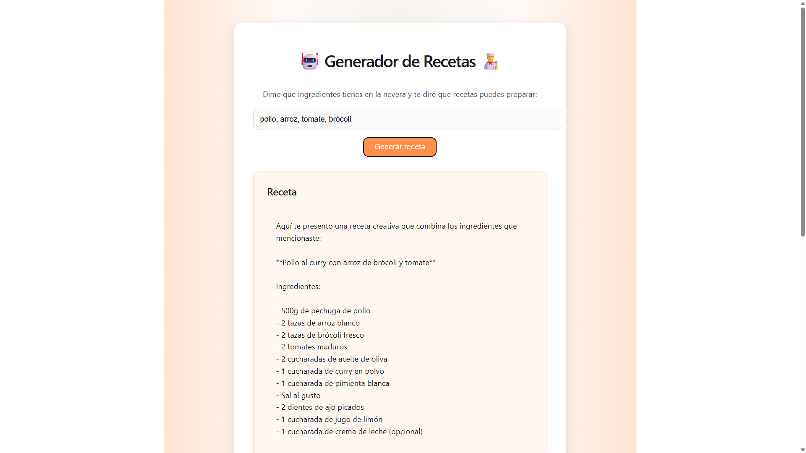

# 🍳 AI Recipe Generator  
Generate complete recipes based on the ingredients you already have at home.

## 🧠 What is this project?
**AI Recipe Generator** is a simple and fun web app where you type the ingredients you have in your fridge and an AI generates a full recipe with steps, tips, and suggestions.

It’s a great project to practice integrating **React (frontend)** with **Flask (backend)** and an AI model.

---

## 🚀 Features
- Natural language ingredient input  
- AI‑generated recipes  
- Clean and modern UI  
- Lightweight and fast backend  
- Easy‑to‑extend codebase  

---

## 🛠️ Tech Stack

### **Frontend**
- React + Vite  
- CSS Modules  
- Fetch API  

### **Backend**
- Python + Flask  
- AI API (Groq)  
- CORS enabled  

---

## 📦 Installation & Setup

### 1. Clone
git clone https://github.com/tu-usuario/ai-recipe-generator
cd ai-recipe-generator

### 2.Install frontend dependencies
cd frontend
npm install
npm run dev

### 3. Install backend dependencies
cd backend
pip install -r requirements.txt
python app.py

---

## 🧪 How to use
1. Type the ingredients you have (e.g. chicken, rice, onion)
2. Click Generate Recipe
3. The AI will return a complete recipe with steps and suggestions

---

## 📸 Example Screenshot

---

## Deployment
Frontend: https://ai-recipe-generator-3g9dj270l-daniel-godoys-projects.vercel.app/
Backend: https://ai-recipe-generator-9deg.onrender.com

## 🤝 Contributing
Contributions are welcome.
Feel free to open issues, submit PRs, or suggest improvements.